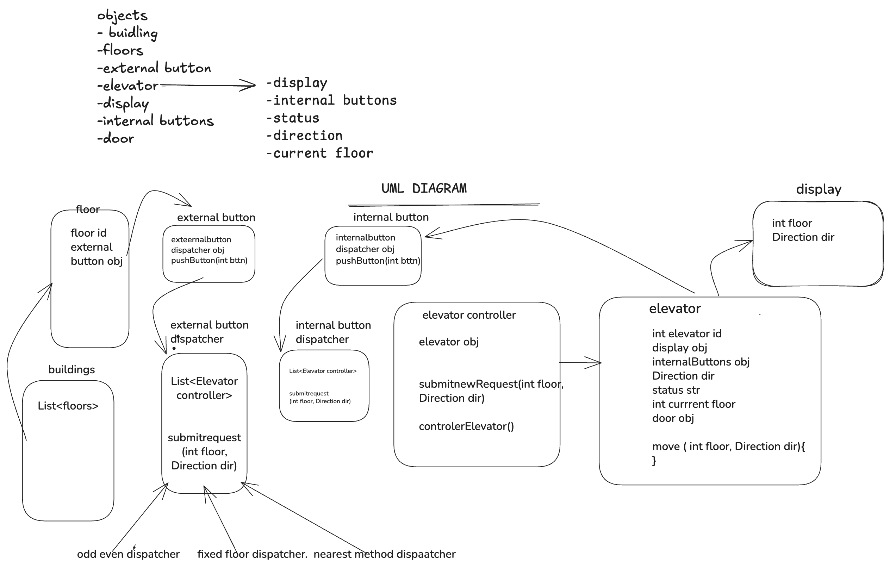

# Elevator System Design

## Problem Statement

Design a scalable Elevator Management System for a multi-floor building using Object-Oriented Design principles.

The system should efficiently manage multiple elevators, process both internal and external requests, and optimize elevator movement to minimize waiting time and improve passenger experience.

---

## Functional Requirements

- Users should be able to request elevators from any floor.
- External panels should support UP and DOWN requests.
- Internal panels should allow users to select destination floors.
- Elevator should support UP, DOWN and IDLE states.
- System should support multiple elevators.
- Elevator scheduler should determine the most suitable elevator.
- Doors should automatically open and close at stops.

---

## Key Concepts Covered

- SOLID Principles
- Object-Oriented Design
- Design Patterns
- State Management
- Elevator Scheduling Algorithms

---

## UML Diagram

